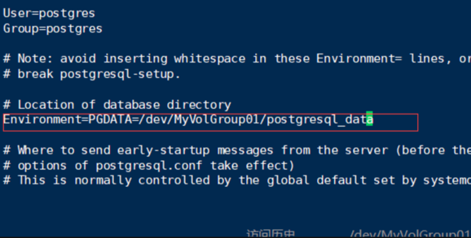
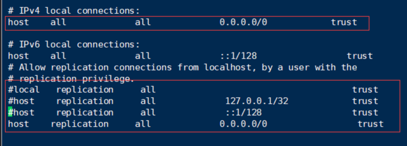
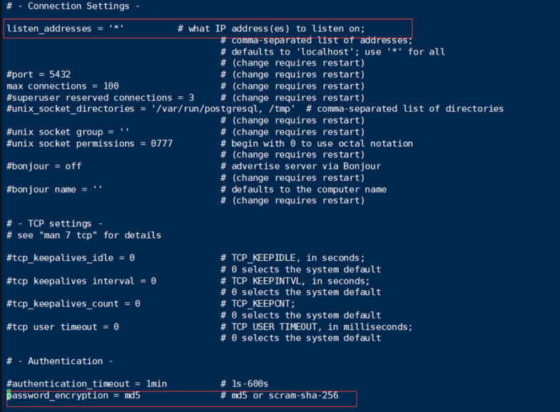

虚拟机安装postgres和postgis：https://blog.csdn.net/GISuuser/article/details/113391729

一 安装postgres：
安装rpm：
yum install -y https://download.postgresql.org/pub/repos/yum/reporpms/EL-7-x86_64/pgdg-redhat-repo-latest.noarch.rpm

安装postgres：
yum list | grep postgresql #查看可安装的列表
yum install postgresql12-contrib postgresql12-server -y #安装

创建存储文件加：
mkdir -p /mylvm/postgresql_data #自己的数据存储路径
chown postgres:postgres /mylvm/postgresql_data #授权postgres用户使用
chmod 750 /mylvm/postgresql_data # 设置权限

设置环境变量：
vi /etc/profile
内容：
export PATH=/usr/pgsql-12/bin:$PATH
export LD_LIBRARY_PATH=/usr/pgsql-12/lib
export PGDATA=/mylvm/postgresql_data  #注意自己的路径

刷新环境变量：
source /etc/profile #刷新

配置service文件：
修改vim /usr/lib/systemd/system/postgresql-12.service文件的内容，在#Location of database direcotry里面指定正确的PGDATA：
内容：Environment=PGDATA=/mylvm/postgresql_data

初始化数据库服务：
su postgres # 切换用户
initdb #初始化数据库

启动数据库服务，需要切换回root用户：
systemctl enable postgresql-12.service #配置开机启动
service postgresql-12 start #启动
service postgresql-12 status #查看状态

设置postgres账户密码：
passwd postgres

然后输入两次相同的密码
更新数据库postgres账户密码
最好和8保持一致
su postgres
psql
ALTER USER postgres WITH PASSWORD 'postgres';

------postgres 安装完毕------
二 安装postgis：
安装工具和PostGIS：
yum  install wget net-tools epel-release -y
yum install postgis30_12 postgis30_12-client -y
yum install ogr_fdw12 -y
yum install pgrouting_12 -y

开放端口和服务，防火墙设置，如果没有开启防火墙，可以不设置：
firewall-cmd --add-service=postgresql --permanent  #透过服务
firewall-cmd --zone=public --add-port=8080/tcp --permanent //添加端口
systemctl restart firewalld.service//重启防火墙

修改配置文件：
配置文件在前面配置的数据存储目录下
vi /mylvm/postgresql_data/pg_hba.conf

要注意，上图的IPv4，那一行一定要改，否则远程连不上
vi /mylvm/postgresql_data/postgresql.conf

监听和认证配置
特别要注意，网上一般让配置password_encryption = no，一旦你这么配置了，服务也就无法启动了，正确的就是md5，文件后面描述的是二选一，没有其他选项

------- postgis安装完毕------
到此为止，已经部署结束，创建数据库什么的，自己本地装一个pgAdmin或者navicat,操作这个数据库还是很方便的

